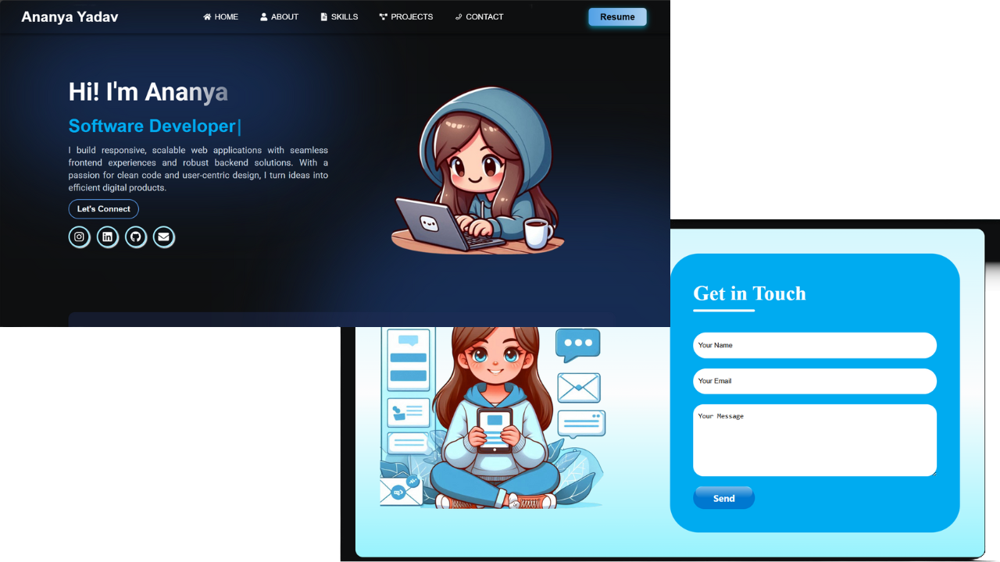

# 👩‍💻 Ananya Yadav – React Developer Portfolio



A clean, responsive portfolio website built with React to present my development skills, projects, and professional background.

## ✨ Highlights

- 📂 Multi-section layout: Hero, About, Skills, Projects, Contact
- 🎨 Custom styling using CSS Modules and React-Bootstrap
- 📱 Fully responsive for mobile and desktop screens
- 🔗 Integrated social links and contact options


## ⚙️ Getting Started

**Clone the repository:**

```bash
git clone https://github.com/ananyayadav/portfolio.git
cd portfolio
```

**Install dependencies:**

```bash
npm install
```

**Start development server:**

```bash
npm start
```

Visit `http://localhost:5173` to preview the site in your browser.

---

## 🧩 Customize the Portfolio

All sections are component-based.

To edit your details:
- Go to `src/components/`
- Open files like `Hero.jsx`, `Skills.jsx`, `Projects.jsx`, `Contact.jsx`
- Update text, links, or images as needed

---

## 💬 Feedback & Support

If you like this project or find it useful, feel free to give it a ⭐  
I’d love to hear your thoughts or improvements!

---

### Made with ❤️ by Ananya Yadav
